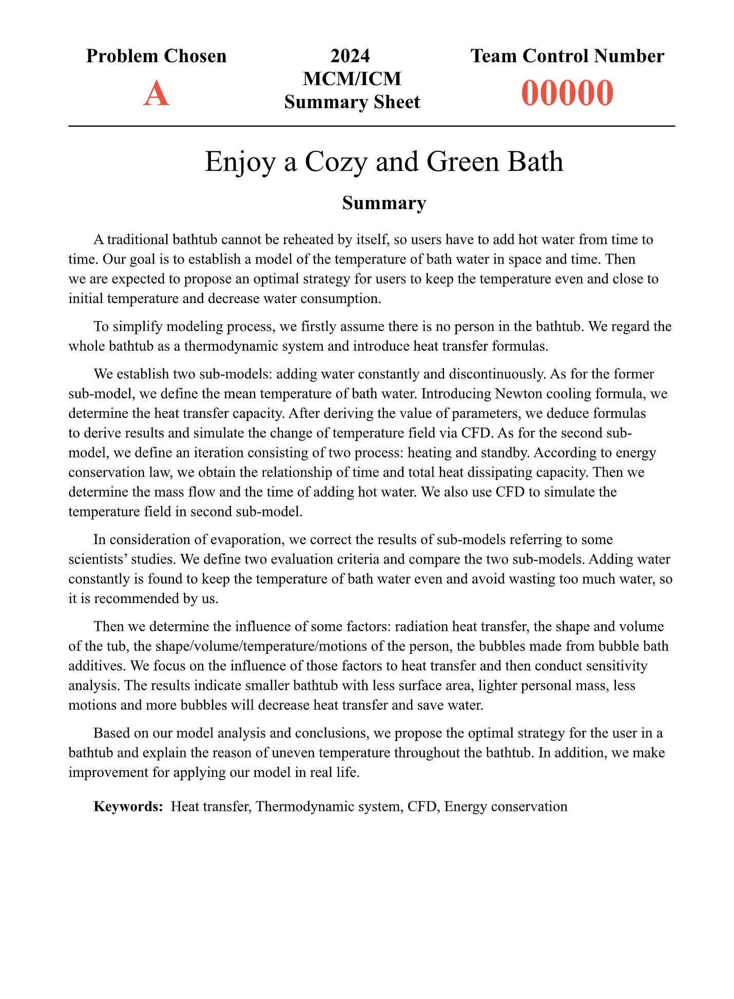
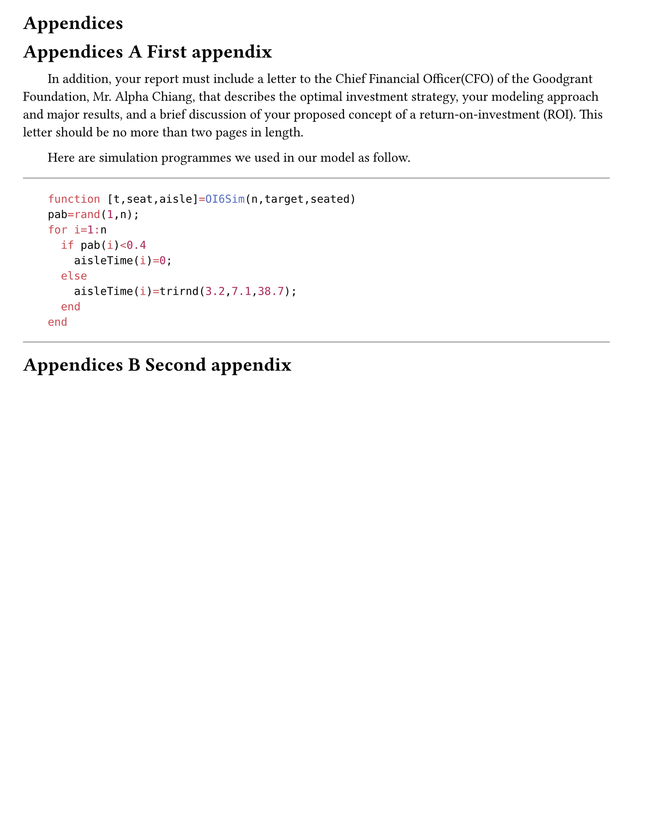
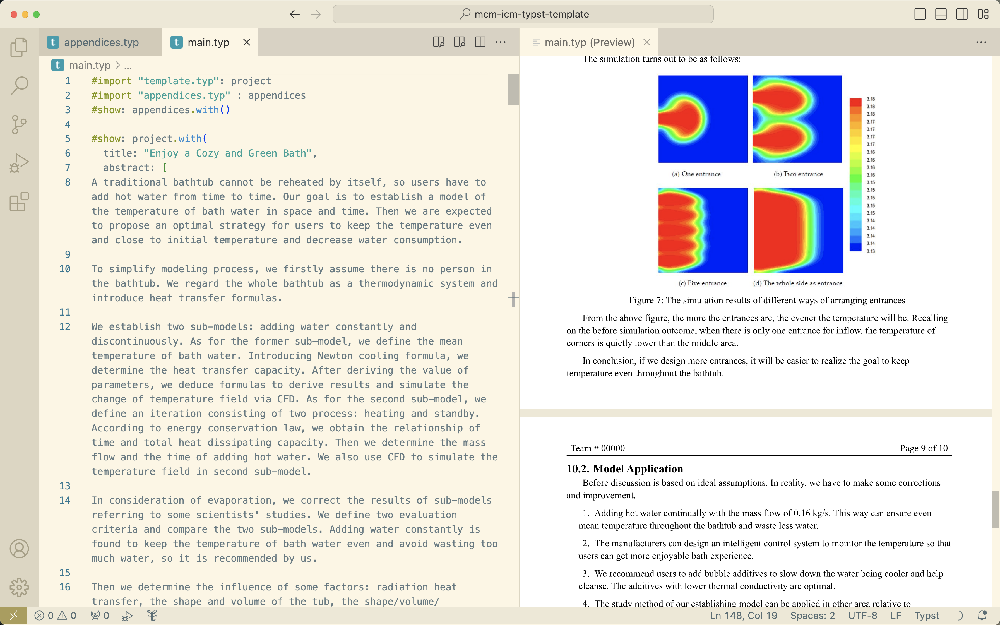

# MCM/ICM [Typst](https://typst.app) Template
- [English](#what-is-mcmicm)
- [中文](#what-is-mcmicm)

## What is MCM/ICM
> [COMAP](https://www.comap.com/contests/mcm-icm)'s Mathematical Contest in Modeling (MCM) and Interdisciplinary Contest in Modeling (ICM) are international contests for high school students and college undergraduates. The contests challenge teams of up to three students to analyze, model, solve, and present solution reports to an open-ended application problem. In these contests research, analytics, and applied intelligence are just as important as time management and problem selection.

## What is Typst
Typst is a new markup-based typesetting system that is designed to be as powerful as LaTeX while being much easier to learn and use.

- [Typst Github](https://github.com/typst/typst)
- [Typst Homepage](https://typst.app)

## Preview
- ./img/  # default image folder
- ./appendices.typ # appendices of the thesis
- ./main.typ  # main body of the thesis
- ./template.typ  # template file
- ./[main.pdf](main.pdf) # default output pdf
- ./refs.bib # bibliography file

## Usage:
Run `typst compile main.typ` to obtain main.pdf

You can try it online ([Click Me](https://typst.app/project/rgsg7a58qn3fKa7jPhbl2U)) or run locally.
I strongly recommand writing with VSCode. 

## Version
Typst>=0.9.0 is recommanded.

## License
[MIT](LICENSE)

## Contribute
Welcome to PRs.
